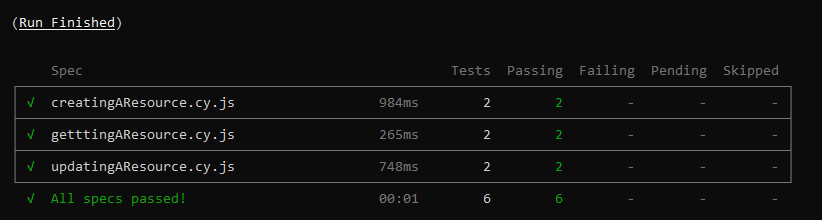

<h1>Automação de testes de API com Cypress</h1>

  
  

### Tecnologias utilizadas

  

As seguintes ferramentas foram usadas na construção do projeto:
<br>

<a  href="https://docs.cypress.io/guides/getting-started/installing-cypress">


</a>
<br>

<a  href="https://www.npmjs.com/package/ajv">


</a>

  

### Pré-requisitos

  

Antes de começar, você vai precisar ter instalado em sua máquina as seguintes ferramentas:

  

<br>

<a  href="https://git-scm.com/downloads">


</a>

<br>
<a  href="https://code.visualstudio.com/">


</a>

<br>

  

### Instalando dependências e rodando os testes.

  

```bash

# No terminal rode o comando abaixo para clonar o projeto:
$ git clone https://github.com/nataciaPinheiro/cypress-api-tests.git

# Acesse a pasta do projeto 
$ cd cypress-api-tests

# Rode o comando abaixo:
$ npm install 

# Após instalar as dependências, você pode rodar os testes com o seguinte comando:
$ npm run test
 
# Após a conclusão dos testes a sáida do seu terminal deve ter a saida semelhante com a imagem abaixo:
```

***

  

